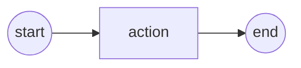
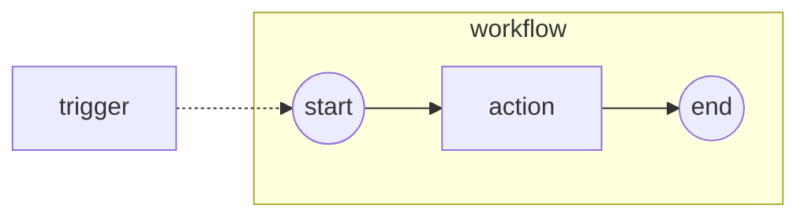
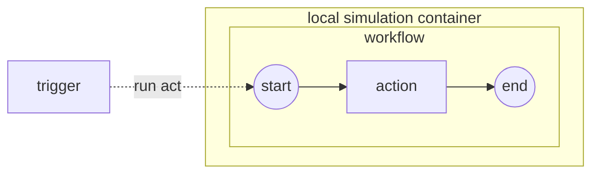

# Tip of the Week: Repository Workflows with Github Actions

> Each week we seek to provide a software tip of the week geared towards helping you achieve your software goals. Views expressed in the content belong to the content creators and not the organization, its affiliates, or employees. If you have any software questions or suggestions for an upcoming tip of the week, please don’t hesitate to reach out to #software-engineering on Slack or email DBMISoftwareEngineering at olucdenver.onmicrosoft.com

__TLDR (too long, didn't read);__

## Workflows

## Github Actions

## Testing

## Additional Resources
