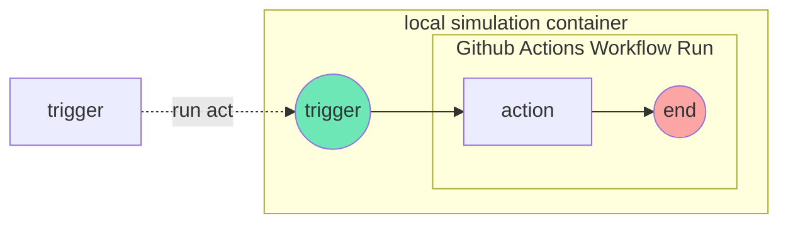
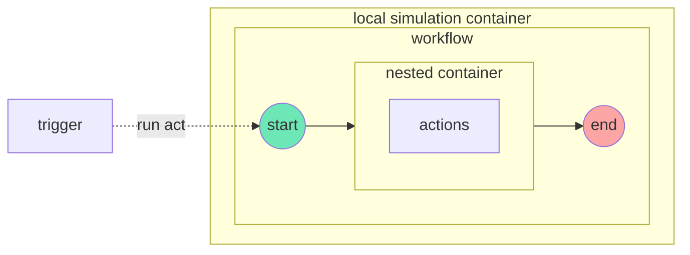

# Tip of the Week: Repository Workflows with Github Actions

> Each week we seek to provide a software tip of the week geared towards helping you achieve your software goals. Views expressed in the content belong to the content creators and not the organization, its affiliates, or employees. If you have any software questions or suggestions for an upcoming tip of the week, please don’t hesitate to reach out to #software-engineering on Slack or email DBMISoftwareEngineering at olucdenver.onmicrosoft.com

__TLDR (too long, didn't read);__

## Workflows

[Workflows](https://en.wikipedia.org/wiki/Workflow) consist of sequenced activities used by various systems. Software development uses workflows to help accomplish work the same way each time. Generally, workflow engines consist of start (what triggers a workflow to begin), actions (work being performed in sequence), and an ending (where the work stops). There are [many workflow engines](https://s.apache.org/existing-workflow-systems), including some which help accomplish work alongside version control.

## Github Actions

[Github Actions](https://docs.github.com/en/actions) is a feature of Github which allows you to run workflows in relation to your code as a [continuous integration](https://en.wikipedia.org/wiki/Continuous_integration) tool. For example, one can use Github actions to make sure code related to a [Github Pull Request](https://docs.github.com/en/pull-requests/collaborating-with-pull-requests/proposing-changes-to-your-work-with-pull-requests/about-pull-requests) passes all tests for the repository. Github Actions may be specified using [YAML files](https://en.wikipedia.org/wiki/YAML) within your repository's `.github/workflows` directory by using syntax specific to [Github's workflow specification](https://docs.github.com/en/actions/using-workflows/workflow-syntax-for-github-actions). In addition to running tests, Github Actions

## Testing with Act

## Moving Beyond Act

## Additional Resources
