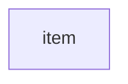

# Tip of the Week: Data Quality Checks



<!-- excerpt start -->

<!-- excerpt end -->

Outline:

- Covering data quality tools and techniques to help decrease errors and increase development velocity.

- Probablistic data quality checks
  - [Great Expectations](https://github.com/great-expectations/great_expectations)
  - [Assertr](https://github.com/ropensci/assertr/)

- Schema-based testing
  - [Pandera](https://github.com/unionai-oss/pandera)
  - [JSONschema](https://github.com/python-jsonschema/jsonschema)

- Shift-left testing at the source ([link](https://en.wikipedia.org/wiki/Shift-left_testing))
  - [DVC](https://github.com/iterative/dvc)
  - [SQLFluff](https://github.com/sqlfluff/sqlfluff)
  - [Liquibase](https://github.com/liquibase/liquibase)
    - [Database-as-code](https://speakerdeck.com/tastapod/arent-we-forgetting-someone)

__TLDR (too long, didn't read);__

## Overview



