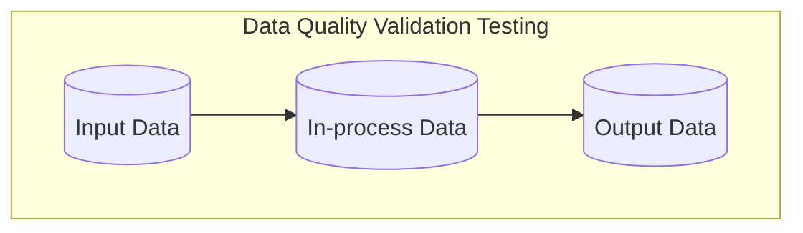

# Tip of the Week: Data Quality Checks and Validation Testing



<!-- excerpt start -->

<!-- excerpt end -->

Outline:

- Covering data quality tools and techniques to help decrease errors and increase development velocity.

- Data verification testing
  - [Great Expectations](https://github.com/great-expectations/great_expectations)
  - [Assertr](https://github.com/ropensci/assertr/)

- Data schema testing
  - [Pandera](https://github.com/unionai-oss/pandera)
  - [JSONschema](https://github.com/python-jsonschema/jsonschema)

- Data source testing ([link](https://en.wikipedia.org/wiki/Shift-left_testing))
  - [DVC](https://github.com/iterative/dvc)
  - [Liquibase](https://github.com/liquibase/liquibase)
    - [Database-as-code](https://speakerdeck.com/tastapod/arent-we-forgetting-someone)

__TLDR (too long, didn't read);__

## Data Quality Validation via Software Tests



_Diagram showing input, in-process data, and output data as a workflow._

Data orientated software development can benefit from a specialized focus on varying aspects of data quality.
We can use software-based testing techniques to validate certain qualities of the data in order to meet a declarative standard (where one doesn't need to guess or rediscover known issues).
These come in a number of forms and generally follow existing [software testing](https://en.wikipedia.org/wiki/Software_testing) approaches.
This article will cover just a few tools and techniques for addressing data quality validation testing.

One concept we'll use to present these ideas is ["data at rest" vs "data in use"](https://en.wikipedia.org/wiki/Data_at_rest).
Data at rest is data which changes infrequently, such as a CSV or [Parquet](https://github.com/apache/parquet-format) file.
Data in use can be considered data which changes frequently, like a [Pandas DataFrame](https://pandas.pydata.org/docs/reference/api/pandas.DataFrame.html) or database which receives many updates per minute.

## Data Essence Testing

```mermaid!
flowchart LR

```

We often need to verify a certain essence surrounding data in order to ensure it meets minimum standards.
The word "essence" is used here to group together loose or very specific qualities of the data.
These verifications often are implied by software which will eventually use the data, which can emit warnings or errors when they find the data does not meet these standards.
Outside of software usage, we also sometimes need to meet minimum standards in order to be sure it indicates what we think it does.

___We can avoid these challenges by performing tests on our data to verify the essence of the result before it reaches later stages.___

Examples of these verifications might include:

- The dataset has no null values.
- The dataset has no more than 3 columns.
- The dataset has a column called `numbers` which includes numbers in the range of 0-10.

### Data Essence Testing - Great Expectations

```python
"""
Example of using Great Expectations
Referenced with modifications from: 
https://docs.greatexpectations.io/docs/tutorials/quickstart/
"""
import great_expectations as gx

# get gx DataContext
# see: https://docs.greatexpectations.io/docs/terms/data_context
context = gx.get_context()

# set a context data source 
# see: https://docs.greatexpectations.io/docs/terms/datasource
validator = context.sources.pandas_default.read_csv(
    "https://raw.githubusercontent.com/great-expectations/gx_tutorials/main/data/yellow_tripdata_sample_2019-01.csv"
)

# add and save expectations 
# see: https://docs.greatexpectations.io/docs/terms/expectation
validator.expect_column_values_to_not_be_null("pickup_datetime")
validator.expect_column_values_to_be_between("passenger_count", auto=True)
validator.save_expectation_suite()

# checkpoint the context with the validator
# see: https://docs.greatexpectations.io/docs/terms/checkpoint
checkpoint = context.add_or_update_checkpoint(
    name="my_quickstart_checkpoint",
    validator=validator,
)

# gather checkpoint expectation results
checkpoint_result = checkpoint.run()

# show the checkpoint expectation results
context.view_validation_result(checkpoint_result)
```

[Great Expectations](https://github.com/great-expectations/great_expectations) provides data essence testing features through the use of declarative ["expectations"](https://greatexpectations.io/expectations/) about the data involved.
Great Expectations expectations act as a way to define and validate the essence of the data.
See the above example for a quick reference of how these work.


