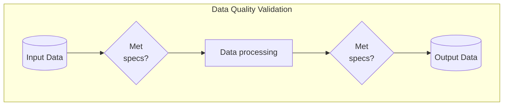
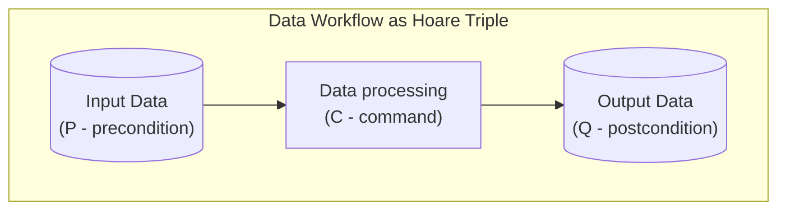
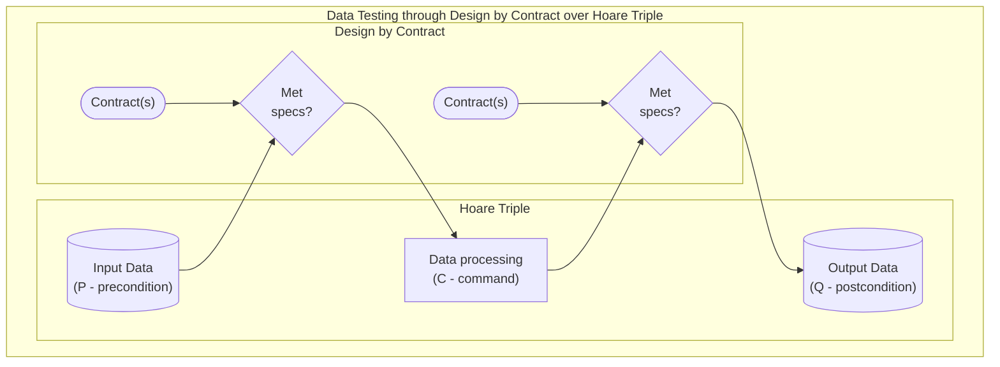
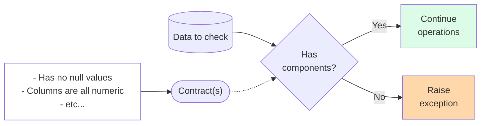
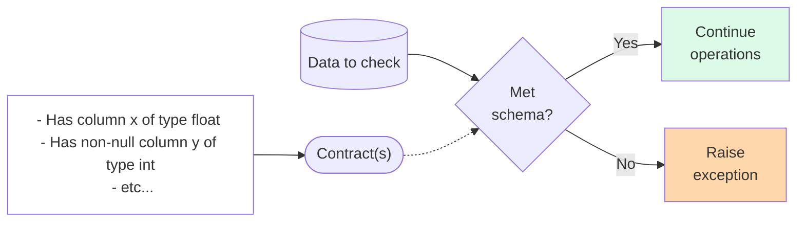

# Tip of the Week: Data Quality Checks and Validation Testing



<!-- excerpt start -->

<!-- excerpt end -->

Outline:

- Covering data quality tools and techniques to help decrease errors and increase development velocity.

- Data verification testing
  - [Great Expectations](https://github.com/great-expectations/great_expectations)
  - [Assertr](https://github.com/ropensci/assertr/)

- Data schema testing
  - [Pandera](https://github.com/unionai-oss/pandera)
  - [JSONschema](https://github.com/python-jsonschema/jsonschema)

- Data source testing ([link](https://en.wikipedia.org/wiki/Shift-left_testing))
  - [DVC](https://github.com/iterative/dvc)
  - [Liquibase](https://github.com/liquibase/liquibase)
    - [Database-as-code](https://speakerdeck.com/tastapod/arent-we-forgetting-someone)

__TLDR (too long, didn't read);__

## Data Quality Validation via Software Tests



_Diagram showing input, in-process data, and output data as a workflow._

Data orientated software development can benefit from a specialized focus on varying aspects of data quality.
We can use software-based testing techniques to validate certain qualities of the data in order to meet a declarative standard (where one doesn't need to guess or rediscover known issues).
These come in a number of forms and generally follow existing [software testing](https://en.wikipedia.org/wiki/Software_testing) approaches.
This article will cover just a few tools and techniques for addressing data quality validation testing.

## Data Quality Testing Concepts

### Hoare Triple



One concept we'll use to present these ideas is [_Hoare logic_](https://en.wikipedia.org/wiki/Hoare_logic), which is a system for reasoning on [software correctness](https://en.wikipedia.org/wiki/Correctness_(computer_science)).
Hoare logic includes the idea of a [Hoare triple](https://en.wikipedia.org/wiki/Hoare_logic#Hoare_triple) ($ {\displaystyle \{P\}C\{Q\}} $) where $ {\displaystyle \{P\}} $ is an assertion of precondition, $ {\displaystyle \ C} $ is a command, and $ {\displaystyle \{Q\}} $ is a postcondition assertion.
Software development using data often entails (sometimes assumed) assertions of precondition from data sources, a transformation or command which changes the data, and a (sometimes assumed) assertion of postcondition in a data output or result.

### Design by Contract



Hoare logic and Software correctness help describe [Design by contract (DbC)](https://en.wikipedia.org/wiki/Design_by_contract), a software approach involving the formal specification of "contracts" which help ensure we meet our intended goals.
DbC helps describe how to create assertions when proceeding through Hoare triplet states for data.
These concepts provide a framework for thinking about the tools mentioned below.

## Data Component Verification



_Diagram showing data components being checked through contracts and raising an error if they aren't met or continuing operations if they are met._

We often need to verify a certain components surrounding data in order to ensure it meets minimum standards.
The word "component" is used here from the context of [component-based software design](https://en.wikipedia.org/wiki/Component-based_software_engineering) to group together reusable, modular qualities of the data where sometimes we don't know (or want) to specify granular aspects (such as schema, type, column name, etc).
These components often are implied by software which will eventually use the data, which can emit warnings or errors when they find the data does not meet these standards.
Oftentimes these components are contracts checking postconditions of earlier commands or procedures, ensuring the data we receive is accurate to our intention.
___We can avoid these challenges by creating contracts for our data to verify the components of the result before it reaches later stages.___

Examples of these data components might include:

- The dataset has no null values.
- The dataset has no more than 3 columns.
- The dataset has a column called `numbers` which includes numbers in the range of 0-10.

### Data Component Verification - Great Expectations

```python
"""
Example of using Great Expectations
Referenced with modifications from: 
https://docs.greatexpectations.io/docs/tutorials/quickstart/
"""
import great_expectations as gx

# get gx DataContext
# see: https://docs.greatexpectations.io/docs/terms/data_context
context = gx.get_context()

# set a context data source 
# see: https://docs.greatexpectations.io/docs/terms/datasource
validator = context.sources.pandas_default.read_csv(
    "https://raw.githubusercontent.com/great-expectations/gx_tutorials/main/data/yellow_tripdata_sample_2019-01.csv"
)

# add and save expectations 
# see: https://docs.greatexpectations.io/docs/terms/expectation
validator.expect_column_values_to_not_be_null("pickup_datetime")
validator.expect_column_values_to_be_between("passenger_count", auto=True)
validator.save_expectation_suite()

# checkpoint the context with the validator
# see: https://docs.greatexpectations.io/docs/terms/checkpoint
checkpoint = context.add_or_update_checkpoint(
    name="my_quickstart_checkpoint",
    validator=validator,
)

# gather checkpoint expectation results
checkpoint_result = checkpoint.run()

# show the checkpoint expectation results
context.view_validation_result(checkpoint_result)
```

_Example code leveraging Python package Great Expectations to perform various data contract validation._

[Great Expectations](https://github.com/great-expectations/great_expectations) is a Python project which provides data  contract verification features through the use of component called ["expectations"](https://greatexpectations.io/expectations/) about the data involved.
These expectations act as a standardized way to define and validate the component of the data in the same way across different datasets or projects.
In addition to providing a mechanism for validating data contracts, Great Expecations also provides a way to [view validation results](https://docs.greatexpectations.io/docs/guides/setup/configuring_metadata_stores/configure_result_stores), [share expectations](https://docs.greatexpectations.io/docs/guides/setup/configuring_metadata_stores/configure_expectation_stores), and also [build data documentation](https://docs.greatexpectations.io/docs/guides/setup/configuring_data_docs/host_and_share_data_docs).
See the above example for a quick code reference of how these work.

### Data component Verification - Assertr

```R
# assertr example code
# referenced with modifications from:
# https://docs.ropensci.org/assertr/articles/assertr.html
library(dplyr)
library(assertr)

# set our.data to reference the mtcars dataset
our.data <- mtcars

# simulate an issue in the data for contract specification
our.data$mpg[5] <- our.data$mpg[5] * -1

# use verify to validate that column mpg >= 0
our.data %>%
  verify(mpg >= 0)

# use assert to that column mpg is within the bounds of 0 to infinity
our.data %>%
  assert(within_bounds(0,Inf), mpg)
```

_Example code leveraging R package Assertr to perform various data contract validation._

[Assertr](https://github.com/ropensci/assertr/) is an R project which provides similar data component assertions in the form of verify, assert, and insist methods ([see here for more documentation](https://docs.ropensci.org/assertr/articles/assertr.html)).
Using Assertr enables a similar but more lightweight functionality to that of Great Expectations.
See the above for an example of how to use it in your projects.

## Data Schema Verification



_Diagram showing data __more granular contracts as "schema"__ being checked through contracts and raising an error if they aren't met or continuing operations if they are met._

Sometimes we need greater


