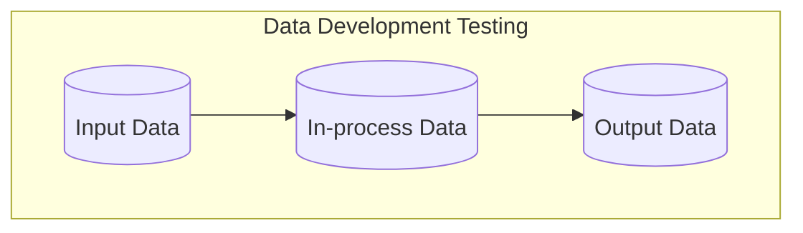

# Tip of the Week: Data Quality Checks



<!-- excerpt start -->

<!-- excerpt end -->

Outline:

- Covering data quality tools and techniques to help decrease errors and increase development velocity.

- Data fitness testing
  - [Great Expectations](https://github.com/great-expectations/great_expectations)
  - [Assertr](https://github.com/ropensci/assertr/)

- Data unit testing
  - [Pandera](https://github.com/unionai-oss/pandera)
  - [JSONschema](https://github.com/python-jsonschema/jsonschema)

- Data source testing ([link](https://en.wikipedia.org/wiki/Shift-left_testing))
  - [DVC](https://github.com/iterative/dvc)
  - [Liquibase](https://github.com/liquibase/liquibase)
    - [Database-as-code](https://speakerdeck.com/tastapod/arent-we-forgetting-someone)

__TLDR (too long, didn't read);__

## Data Quality Validation via Software Tests

_Diagram showing input, in-process data, and output data as a workflow._

Data orientated software development can benefit from a specialized focus on varying aspects of data quality.
Data quality and capabilities to reach certain standards may be assessed similarly to other software-based tests.
These come in a number of forms and generally follow existing [software testing](https://en.wikipedia.org/wiki/Software_testing) approaches.
This article will cover just a few tools and techniques for addressing data development testing.

## Data fitness testing


