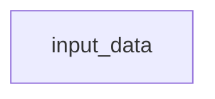
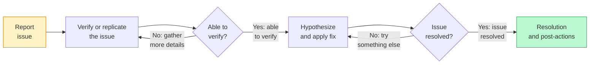

# Tip of the Week: 



__TLDR (too long, didn't read);__

## Introduction

_Diagram._

[Thanksgiving](https://en.wikipedia.org/wiki/Thanksgiving) is a holiday practiced in many countries which focuses on gratitude for good harvests of the preceding year.
In the United States, we celebrate Thanksgiving on November 23rd each year often by eating meals we create together with others.
This post channels the spirit of Thanksgiving by _giving_ our thanks through _code_ as a ___"Codesgiving"___,  acknowledging and creating better software together.

<!-- excerpt start -->
<!-- excerpt end -->

## Giving Thanks to Open-source Harvests

Part of building software involves the use of code which others have built, maintained, and distributed for a wider audience.
Using other people's work often comes in the form of [open-source](https://en.wikipedia.org/wiki/Open_source) "harvesting" as we find solutions to software challenges we face.
Examples might include installing and depending upon Python packages from [PyPI](https://en.wikipedia.org/wiki/Python_Package_Index) or R packages from [CRAN](https://en.wikipedia.org/wiki/R_package#Comprehensive_R_Archive_Network_(CRAN)) within your software projects.

> "Real generosity toward the future lies in giving all to the present."
> \- Albert Camus

These open-source projects have internal costs which are sometimes invisible to those who consume them.
Every software project has an implied level of [software gardening](https://bssw.io/blog_posts/long-term-software-gardening-strategies-for-cultivating-scientific-development-ecosystems) time costs involved to impede decay,  practice continuous improvements and evolve the work.
One way to actively share our thanks for the projects we depend on is through applying our time towards code contributions on them.

## All Contributions Matter

Contributing to open-source can come in many forms and contributions don't need to be gigantic to make an impact.
Software often involves simplifying complexity.

> ...
> Simple is better than complex.
> Complex is better than complicated.
> ...
> \- [PEP 20: The Zen of Python](https://peps.python.org/pep-0020/)

Simplification requires many actions beyond solely writing code.
For example, a short walk outside, a conversation with someone, or a nap can sometimes help us with breakthroughs when it comes to development.
By the same token, open-source benefits greatly from communications on discussion boards, bug or feature descriptions, or other work that might not be strictly considered "engineering".

## Codesgiving for CellProfiler

Members of the [Way Lab](https://www.waysciencelab.com/) sometimes depend upon single-cell feature data generated from software called [CellProfiler](https://cellprofiler.org/).
CellProfiler is an open-source application for biological image analysis and data generation.
While there are many ways CellProfiler can be used, the Way Lab most often uses [Conda](https://en.wikipedia.org/wiki/Conda_(package_manager)) to help manage their research data science environments (including CellProfiler as a dependency).
Lately, we've noticed that MacOS systems sometimes have trouble completing their install of CellProfiler through Conda environments (where Linux-based systems appear to not have any issue).
I decided this might be a good area to explore for Codesgiving.

### Troubleshooting Approach

_Diagram._

### Issue Reporting

Issues are often best reported through written stories captured within a bug or feature tracking system (such as GitHub Issues) which if possible also include example code or logs.
One template for reporting issues is through a "user story".
A user story typically comes in the form: `As a < type of user >, I want < some goal > so that < some reason >.` ([Mountain Goat Software: User Stories](https://www.mountaingoatsoftware.com/agile/user-stories)).

### Issue Verification

