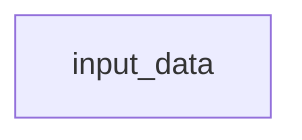

# Tip of the Week: 



__TLDR (too long, didn't read);__

## Introduction

_Diagram._

[Thanksgiving](https://en.wikipedia.org/wiki/Thanksgiving) is a holiday practiced in many countries which focuses on gratitude for good harvests of the preceding year.
In the United States, we celebrate Thanksgiving on November 23rd each year often by eating meals we create together with others.
This post channels the spirit of Thanksgiving by _giving_ our thanks through _code_ as a ___"Codesgiving"___,  acknowledging and creating better software together.

<!-- excerpt start -->
<!-- excerpt end -->

## Giving Thanks to Open Source Harvests

Part of building software involves the use of code which others have built, maintained, and distributed for a wider audience.
Using other people's work often comes in the form of [open source](https://en.wikipedia.org/wiki/Open_source) "harvesting" as we find solutions to software challenges we face.
Examples might include installing and depending upon Python packages from [PyPI](https://en.wikipedia.org/wiki/Python_Package_Index) or R packages from [CRAN](https://en.wikipedia.org/wiki/R_package#Comprehensive_R_Archive_Network_(CRAN)) within your software projects.

These open source projects have internal costs which are sometimes invisible to those who consume them.
Every software project has an implied level of [software gardening](https://bssw.io/blog_posts/long-term-software-gardening-strategies-for-cultivating-scientific-development-ecosystems) time costs involved to impede decay,  practice continuous improvements and evolve the work.
One way to actively share our thanks for these projects is through applying our time towards code contributions on them.

> "Real generosity toward the future lies in giving all to the present." - Albert Camus

## Codesgiving for CellProfiler
