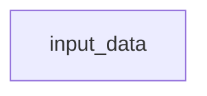
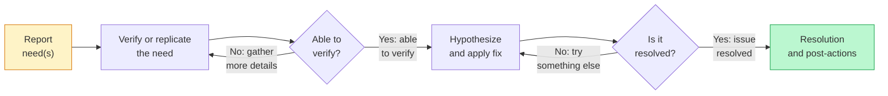
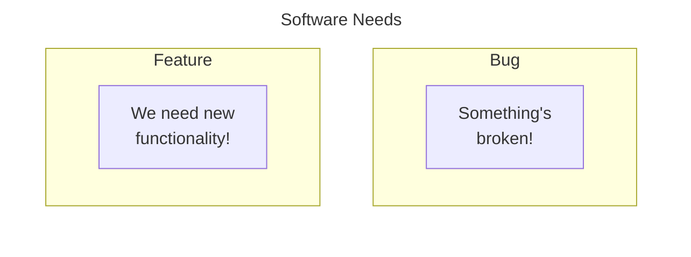

# Tip of the Week: 



__TLDR (too long, didn't read);__


## Introduction



_Diagram._

[Thanksgiving](https://en.wikipedia.org/wiki/Thanksgiving) is a holiday practiced in many countries which focuses on gratitude for good harvests of the preceding year.
In the United States, we celebrate Thanksgiving on November 23rd each year often by eating meals we create together with others.
This post channels the spirit of Thanksgiving by _giving_ our thanks through _code_ as a ___"Codesgiving"___,  acknowledging and creating better software together.

<!-- excerpt start -->
<!-- excerpt end -->

## Giving Thanks to Open-source Harvests

Part of building software involves the use of code which others have built, maintained, and distributed for a wider audience.
Using other people's work often comes in the form of [open-source](https://en.wikipedia.org/wiki/Open_source) "harvesting" as we find solutions to software challenges we face.
Examples might include installing and depending upon Python packages from [PyPI](https://en.wikipedia.org/wiki/Python_Package_Index) or R packages from [CRAN](https://en.wikipedia.org/wiki/R_package#Comprehensive_R_Archive_Network_(CRAN)) within your software projects.

> "Real generosity toward the future lies in giving all to the present."
> \- Albert Camus

These open-source projects have internal costs which are sometimes invisible to those who consume them.
Every software project has an implied level of [software gardening](https://bssw.io/blog_posts/long-term-software-gardening-strategies-for-cultivating-scientific-development-ecosystems) time costs involved to impede decay,  practice continuous improvements and evolve the work.
One way to actively share our thanks for the projects we depend on is through applying our time towards code contributions on them.

Many projects are in need of additional people's thinking and development time.
Have you ever noticed something that needs to be fixed or desirable functionality in a project you use?
___Consider adding your contributions to open-source!___

## All Contributions Matter

Contributing to open-source can come in many forms and contributions don't need to be gigantic to make an impact.
Software often involves simplifying complexity.

> ...
> Simple is better than complex.
> Complex is better than complicated.
> ...
> \- [PEP 20: The Zen of Python](https://peps.python.org/pep-0020/)

Simplification requires many actions beyond solely writing code.
For example, a short walk outside, a conversation with someone, or a nap can sometimes help us with breakthroughs when it comes to development.
By the same token, open-source benefits greatly from communications on discussion boards, bug or feature descriptions, or other work that might not be strictly considered "engineering".


## Open-source Contribution Approaches



_Diagram._

It can feel overwhelming to find a way to contribute to open-source.
Similar to other software methodology, modularizing your approach can help you progress without being overwhelmed.
Using a troubleshooting approach like the above can help you break down big challenges into bite-sized chunks.
Consider each step as a "module" or "section" which needs to be addressed sequentially.

#### Software Scheduling Rule of Thumb

The following rule of thumb from _The Mythical Man Month_ can assist with how you structure your time for an open-source contribution.
Notice the emphasis on planning and testing and keep these in mind as you progress (the actual programming time is usually small).
A good motto to keep in mind throughout this process is _Festina Lente_, or "Make haste, slowly."

- 1/3 planning ~(33%)
- 1/6 coding (~16%)
- 1/4 component testing (25%)
- 1/4 system testing (25%)

### Planning an Open-source Contribution

#### Embrace a Learning Mindset

Open-source contributions almost always entail learning of some kind.
Many contributions happen solely in the form of code and text communications which are easily misinterpreted.
__Assume positive intent__ and accept input from others while upholding your own ideas to share successful contributions together.
Prepare yourself by intentionally opening your mind to input from others, even if you're sure you're absolutely "right".

#### Is the Need a Bug or Feature?



One way to help solidify your thinking and the approach is to consider whether what you're proposing is a bug or a feature.
A [software bug](https://en.wikipedia.org/wiki/Software_bug) is considered something which is broken or malfunctioning.
A [software feature](https://en.wikipedia.org/wiki/Software_feature) is generally considered new functionality or a different way of doing things than what exists today.
There's often overlap between these, and sometimes they can inspire branching needs, but individually they usually are more of one than the other.
If you can't decide whether your need is a bug or a feature, consider breaking it down into smaller sub-components so they can be more of one or the other.
Following this strategy will help you communicate the potential for contribution and also clarify the development process.

#### Has the Need Already Been Reported?

Be sure to check whether the bug or feature has already been reported somewhere!
For example, you can look on GitHub Issues with a search query matching the rough idea of what you're thinking about.
If it has been reported already, take a look to see if someone has made a code contribution related to the work already.
If there aren't yet any code contributions and it doesn't look like anyone is working on one, consider volunteering to take a further look into the solution and be sure to acknowledge the existing discussions.
If you're unsure, it's always kind to mention your interest in the report and ask for more information.

#### Reporting the Need for Change

```markdown
# Using `function_x` with `library_y` causes `exception_z`

## Summary

As a `library_y` research software developer I want to use `function_x` for my data so that I can share data for research outcomes.

## Reproducing the error

This error may be seen using Python v3.x on all major OS's using the following code snippet:
...

```

_An example of a user story issue report with imagined code example._

Open-source needs are often best reported through written stories captured within a bug or feature tracking system (such as [GitHub Issues](https://github.com/features/issues)) which if possible also include example code or logs.
One template for reporting issues is through a "user story".
A user story typically comes in the form: `As a < type of user >, I want < some goal > so that < some reason >.` ([Mountain Goat Software: User Stories](https://www.mountaingoatsoftware.com/agile/user-stories)).
Alongside the story, it can help to add in a snippet of code which exemplifies a problem, new functionality, or a potential adjacent / similar solution.
As a general principle, be as __be as specific as you can without going overboard__.
Include things like programming language version, operating system, and other system dependencies that might be related.
Once you have a good written description of the need be sure to submit it where it can be seen by the relevant development community.
For GitHub-based work, this is usually a GitHub Issue, but can also entail discussion board posts to gather buy-in or consensus before proceeding.

#### What Happens After You Submit a Bug or Feature Report?

When making open-source contributions, sometimes it can also help to mention that you're interested in resolving the issue through a related pull request and review.
Oftentimes open-source projects welcome new contributors but may have specific requirements.
These requirements are usually spelled out within a [`CONTRIBUTING.md` document](https://docs.github.com/en/communities/setting-up-your-project-for-healthy-contributions/setting-guidelines-for-repository-contributors) found somewhere in the repository or the organization level documentation.
It's also completely okay to let other contributors build solutions for the issue (like we mentioned before, all contributions matter, including the reporting of bugs or features themselves)!

### Developing and Testing an Open-source Contribution

#### Bug or Feature Verification with Test-driven Development

If you decide to develop a solution for what you reported, one software strategy which can help you remain focused and objective is [test-driven development](https://en.wikipedia.org/wiki/Test-driven_development).
Test-driven development entails the following pattern:

1. Add or modify a test which checks for a bug fix or feature addition
1. Run all tests (expecting the newly added test content to fail)
1. Write a simple version of code which allows the tests to succeed
1. Verify that all tests now pass
1. Return to step 3, refactoring the code as needed

Using this pattern sets a "cognitive milestone" for you as you develop a solution to what was reported.
Open-source projects can have many interesting components which could take time and be challenging to understand.
The addition of the test and related development will help keep you goal-orientated without getting lost in the "software forest" of a project.

#### Developing a Solution

Once you have a test in place for the bug fix or feature addition it's time to work towards developing a solution.
If you've taken time to accomplish the prior steps before this point you may already have a good idea about how to go about a solution.
If not, spend some time investigating the technical aspects of a solution, optionally adding this information to the report or discussion content for further review before development.

Use [timeboxing techniques]() to  help make sure the time you spend in development is no more than necessary.
Also recall that a "simplest version" of the code can often be more quickly refactored and completed than devising a "perfect" solution the first time.
Remember, you'll also very likely have the help of a code review before the code is merged (expect to learn more and add changes during review!).


