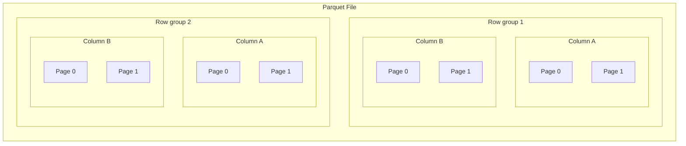

# Parquet: Crafting Data Bridges for Efficient Computation



## Introduction



<!-- excerpt start -->
[Apache Parquet](https://en.wikipedia.org/wiki/Apache_Parquet) is a columnar and strongly-typed tabular data storage format built for scalable processing which is widely compatible with many data models, programming languages, and software systems.
Parquet files (typically denoted with a `.parquet` filename extension) are typically compressed within the format itself and are often used in embedded or cloud-based high-performance scenarios
It has grown in popularity since it was introduced in 2013 and is used as a core data storage technology in many organizations.
This article will introduce the Parquet format from a research data engineering perspective.
<!-- excerpt end -->

## Understanding the Parquet file format

Parquet began around 2013 as work by Twitter and Cloudera collaborators to help solve large data challenges (for example, in [Apache Hadoop](https://en.wikipedia.org/wiki/Apache_Hadoop) systems).
It was partially inspired by a Google Research publication: [_"Dremel: Interactive Analysis of Web-Scale Datasets"_](https://research.google/pubs/dremel-interactive-analysis-of-web-scale-datasets-2/).
Parquet is similar and has related goals to that of the [ORC](https://en.wikipedia.org/wiki/Apache_ORC), [Avro](https://en.wikipedia.org/wiki/Apache_Avro), and [Feather](https://arrow.apache.org/docs/python/feather.html) file formats.
We cover a few pragmatic aspects of the Parquet file format below.

### <i class="fas fa-table-columns"></i>  Columnar data storage

<table>
<tr>
<th>Data Type</th>
<th>Data</th>
<th>How data is organized on file</th>
</tr>
<tr>
<td>CSV</td>
<td>
<table>
<tr>
<td>1</td>
<td>Grapes</td>
</tr>
<tr>
<td>2</td>
<td>Oranges</td>
</tr>
</table>
<td>
<table>
<tr>
<td>1</td><td>Grapes</td><td>2</td><td>Oranges</td>
</tr>
</table>
</td>
</tr>
<tr>
<td>Parquet</td>
<td>
<table>
<tr>
<td>1</td>
<td>Grapes</td>
</tr>
<tr>
<td>2</td>
<td>Oranges</td>
</tr>
</table>
<td>

<table>
<tr>
<td>1</td><td>2</td><td>Grapes</td><td>Oranges</td>
</tr>
</table>

<center>(simplification, see abstractions below)</center>

</td>
</tr>
</table>

_Parquet organizes column values together. CSV intermixes values from multiple columns._
{:.center}

Parquet files store data in a __"columnar"__ way which is distinct from other formats.
We can understand this columnar format by using [plaintext](https://en.wikipedia.org/wiki/Plaintext) [comma-separated value (CSV)](https://en.wikipedia.org/wiki/Comma-separated_values) format as a reference point.
CSV files store data in a row-orientated way by using new lines to represent rows of values.
Reading all values of a single column in CSV often involves seeking through multiple other portions of the data by default.

Parquet files are binary in nature, optimizing storage by arranging values from individual columns in close proximity to each other.
This enables the data to be stored and retrieved more efficiently than possible with CSV files.
For example, Parquet files allow you to query individual columns without needing to traverse non-necessary column value data.

### <i class="fas fa-sitemap"></i> Parquet format abstractions

#### Row groups, column chunks, and pages
<!-- set a max width for mermaid diagram below so it doesn't render so large -->
<style>
.mermaid {
  display: block;
  margin: 0 auto;
  max-height: 400px;
}
</style>



_Parquet organizes data using row groups, columns, and pages._
{:.center}

Parquet files organize column data inside of __row groups__.
Each row group includes chunks of columns in the form of __pages__.
Row groups and column pages are configurable and may change depending on the configuration of your Parquet client.
__Note:__ you don't need to be an expert on these details to leverage and benefit from Parquet as these are often configured for default general purposes.

#### Page encodings

Pages within column chunks may have a number of different __encodings__.
[Parquet encodings](https://github.com/apache/parquet-format/blob/master/Encodings.md) are often selected based on the type of data included within columns and the operational or performance needs associated with a project.
By default, [Plain (`PLAIN`) encoding](https://github.com/apache/parquet-format/blob/master/Encodings.md#plain-plain--0) is used which means all values are stored back to back.
Another encoding type, [Run Length Encoding (`RLE`)](https://github.com/apache/parquet-format/blob/master/Encodings.md#run-length-encoding--bit-packing-hybrid-rle--3), is often used to efficiently store columns with many consecutively repeated values.
Column encodings are sometimes set for each individual column, usually in an automatic way based on the data involved.

### <i class="fas fa-box-archive"></i> Compression

```python
import os
import pyarrow as pa
from pyarrow import parquet

# create a pyarrow table
table = pa.Table.from_pydict(
    {
        "A": [1, 2, 3, 4, 5],
        "B": ["foo", "bar", "baz", "qux", "quux"],
        "C": [0.1, 0.2, 0.3, 0.4, 0.5],
    }
)

# Write Parquet file with Snappy compression
parquet.write_table(table=table, where="example.snappy.parquet", compression="SNAPPY")

# Write Parquet file with Zstd compression
parquet.write_table(table=table, where="example.zstd.parquet", compression="ZSTD")
```

_Parquet files can be compressed as they're written using parameters._
{:.center}

Parquet files may leverage compression to help reduce file size and increase data read performance.
Compression is applied at the page level, combining benefits from various encodings.
Data stored through Parquet is usually compressed when it is written, denoting the compression type through the filename (for example: `filename.snappy.parquet`).
[Snappy](https://en.wikipedia.org/wiki/Snappy_(compression)) is often used as a common compression algorithm for Parquet data.
[Brotli](https://en.wikipedia.org/wiki/Brotli), [Gzip](https://en.wikipedia.org/wiki/Gzip), [ZSTD](https://en.wikipedia.org/wiki/Zstd), [LZ4](https://en.wikipedia.org/wiki/LZ4_(compression_algorithm)) are also sometimes used.
It's worth exploring what compression works best for the data and systems you use (for example, [ZSTD compression may hold benefits](https://www.uber.com/blog/cost-efficiency-big-data)).


### <i class="fas fa-icons"></i> "strongly-typed" Data

```python
import pyarrow as pa
from pyarrow import parquet

# create a pyarrow table
table = pa.Table.from_pydict(
    {
        "A": [1, 2, 3],
        "B": ["foo", "bar", 1],
        "C": [0.1, 0.2, 0.3],
    }
)

# write the pyarrow table to a parquet file
parquet.write_table(table=table, where="example.parquet")

# raises exception:
# ArrowTypeError: Expected bytes, got a 'int' object (for column B)
# Note: while this is an Arrow in-memory data exception, it also
# prevents us from attempting to perform incompatible operations
# within the Parquet file.
```

_Data value must be all of the same type within a Parquet column._
{:.center}

Data within Parquet is considered ["strongly-typed"](https://en.wikipedia.org/wiki/Strong_and_weak_typing), entailing specific data types (such as integer, string, etc.) associated with each column and value.
Attempting to store a data value type which does not match the column data type will usually result in an error (or implied conversion).
This can lead to performance and compression benefits due to how quickly Parquet readers can determine the data type.
Strongly-typed data also embeds a kind of validation directly inside your work (data errors ["shift left"](https://en.wikipedia.org/wiki/Shift-left_testing) and are often discovered earlier).
[See here](https://cu-dbmi.github.io/set-website/2023/10/04/Data-Quality-Validation.html) for more on data quality validation topics we've written about.

### <i class="fas fa-diagram-successor"></i> Complex data handling

```python
import pyarrow as pa
from pyarrow import parquet

# create a pyarrow table with complex data types
table = pa.Table.from_pydict(
    {
        "A": [{"key1": "val1"}, {"key2": "val2"}],
        "B": [[1, 2], [3, 4]],
        "C": [
            bytearray("😊".encode("utf-8")),
            bytearray("🌻".encode("utf-8")),
        ],
    }
)

# write the pyarrow table to a parquet file
parquet.write_table(table=table, where="example.parquet")

# read the schema of the parquet file
print(parquet.read_schema(where="example.parquet"))

# prints:
# A: struct<key1: string, key2: string>
#   child 0, key1: string
#   child 1, key2: string
# B: list<element: int64>
#   child 0, element: int64
# C: binary
```

_Parquet file columns may contain complex data types such as nested types (lists, dictionaries) and byte arrays._
{:.center}

Parquet files may store many data types that are complicated or impossible to store in other formats.
For example, images may be stored using the [byte array](https://parquet.apache.org/docs/file-format/types/) storage type.
Nested data may be stored using [`LIST` or `MAP` logical types](https://github.com/apache/parquet-format/blob/master/LogicalTypes.md#nested-types).
Dates or times may be stored using [various temporal data types.](https://github.com/apache/parquet-format/blob/master/LogicalTypes.md#temporal-types)
Oftentimes, complex data conversion within Parquet files is already implemented (for example, in [PyArrow](https://arrow.apache.org/docs/developers/python.html)).

### <i class="fas fa-tags"></i> Metadata

```python
import pyarrow as pa
from pyarrow import parquet

# create a pyarrow table
table = pa.Table.from_pydict(
    {
        "A": [1, 2, 3],
        "B": ["foo", "bar", "baz"],
        "C": [0.1, 0.2, 0.3],
    }
)

# add custom metadata to table
table = table.replace_schema_metadata(metadata={"data-producer": "CU DBMI SET Blog"})

# write the pyarrow table to a parquet file
parquet.write_table(table=table, where="example.snappy.parquet", compression="SNAPPY")

# read the schema
print(parquet.read_schema(where="example.snappy.parquet"))

# prints
# A: int64
# B: string
# C: double
# -- schema metadata --
# data-producer: 'CU DBMI SET Blog'
```

_Metadata are treated as a distinct and customizable components of Parquet files._
{:.center}

The Parquet format treats data about the data (metadata) separately from that of column value data.
[Parquet metadata](https://parquet.apache.org/docs/file-format/metadata/) includes column names, data types, compression, various statistics about the file, and custom fields (in key-value form).
This metadata may be read without reading column value data which can assist with data exploration tasks (especially if the data are large).

### <i class="fas fa-folder-tree"></i> Multi-file "datasets"

```python
import pathlib
import pyarrow as pa
from pyarrow import parquet

pathlib.Path("./dataset").mkdir(exist_ok=True)

# create pyarrow tables
table_1 = pa.Table.from_pydict({"A": [1]})
table_2 = pa.Table.from_pydict({"A": [2, 3]})

# write the pyarrow table to parquet files
parquet.write_table(table=table_1, where="./dataset/example_1.parquet")
parquet.write_table(table=table_2, where="./dataset/example_2.parquet")

# read the parquet dataset
print(parquet.ParquetDataset("./dataset").read())

# prints (note that, for ex., [1] is a row group of column A)
# pyarrow.Table
# A: int64
# ----
# A: [[1],[2,3]]
```

_Parquet datasets may be composed of one or many individual Parquet files._
{:.center}

Parquet files may be used individually or treated as a "dataset" through file groups which include the same schema (column names and types).
This means you can store "chunks" of Parquet-based data in one or many files and provides opportunities for intermixing or extending data.
When reading Parquet data this way libraries usually use the directory as a way to parse all files as a single dataset.
Multi-file datasets mean you gain the ability to store arbitrarily large amounts of data by sidestepping, for example, [inode](https://en.wikipedia.org/wiki/Inode) limitations.

### <i class="fas fa-forward"></i> Apache Arrow memory format integration

```python
import pathlib
import pyarrow as pa
from pyarrow import parquet

# create a pyarrow table
table = pa.Table.from_pydict(
    {
        "A": [1, 2, 3],
        "B": ["foo", "bar", "baz"],
        "C": [0.1, 0.2, 0.3],
    }
)

# write the pyarrow table to a parquet file
parquet.write_table(table=table, where="example.parquet")

# show schema of table and parquet file
print(table.schema.types)
print(parquet.read_schema("example.parquet").types)

# prints
# [DataType(int64), DataType(string), DataType(double)]
# [DataType(int64), DataType(string), DataType(double)]
```

_Parquet file and Arrow data types are well-aligned._
{:.center}

The Parquet format has robust support and integration with the [Apache Arrow](https://arrow.apache.org/docs/index.html) memory format.
This enables consistency across Parquet integration and how the data are read using various programming languages (the Arrow memory format is relatively uniform across these).

## Performance with Parquet

Parquet files often outperforms traditional formats due to how it is designed.
Other data file formats may vary in performance contingent on specific configurations and system integration.
We urge you to perform your own testing to find out what works best for your circumstances.
See below for a list of references which compare Parquet to other formats.

- CSV vs Parquet - [Speed up data analytics and wrangling with Parquet files (Posit)](https://posit.co/blog/speed-up-data-analytics-with-parquet-files/)
- CSV vs Parquet - [Apache Parquet vs. CSV Files (DZone)](https://dzone.com/articles/how-to-be-a-hero-with-powerful-parquet-google-and)
- Feather vs Parquet - [Feather V2 with Compression Support in Apache Arrow 0.17.0 (Ursa Labs)](https://ursalabs.org/blog/2020-feather-v2/)
- ORC vs Parquet - [The impact of columnar file formats on SQL-on-hadoop engine performance: A study on ORC and Parquet (Concurrency and Computation: Practice and Experience)](https://onlinelibrary.wiley.com/doi/full/10.1002/cpe.5523)

## How can you use Parquet?

The Parquet format is common in many data management platforms and libraries.
Below are a list of just a few popular places where you can use Parquet.

- __Python__
  - Pandas ([`pd.DataFrame.to_parquet()`](https://pandas.pydata.org/pandas-docs/stable/reference/api/pandas.DataFrame.to_parquet.html), [`pd.read_parquet()`](https://pandas.pydata.org/pandas-docs/stable/reference/api/pandas.read_parquet.html))
  - Apache Spark ([Spark SQL Guide: Parquet Files](https://spark.apache.org/docs/latest/sql-data-sources-parquet.html))
  - PyTorch ([`ParquetDataFrameLoader`](https://pytorch.org/data/main/generated/torchdata.datapipes.iter.ParquetDataFrameLoader.html))
  - PyArrow ([PyArrow: Reading and Writing the Apache Parquet Format](https://arrow.apache.org/docs/python/parquet.html))
- __R__
  - dplyr ([Arrow: Working with Arrow Datasets and dplyr](https://arrow.apache.org/docs/2.0/r/articles/dataset.html))
  - Arrow ([`write_parquet()`](https://arrow.apache.org/docs/r/reference/write_parquet.html), [`read_parquet()`](https://arrow.apache.org/docs/r/reference/read_parquet.html))
  - DuckDB ([DuckDB R API](https://duckdb.org/docs/api/r.html), [DuckDB: Reading and Writing Parquet Files](https://duckdb.org/docs/data/parquet/overview))

## Concluding Thoughts

This article covered the Parquet file format including notable features and usage.
Thank you for joining us on this exploration of Parquet.
We appreciate your support, hope the content here helps with your data decisions, and look forward to continuing the exploration of data formats in future posts.
