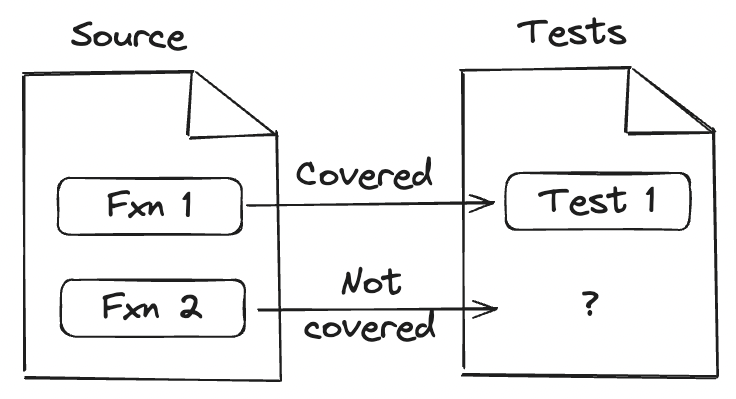
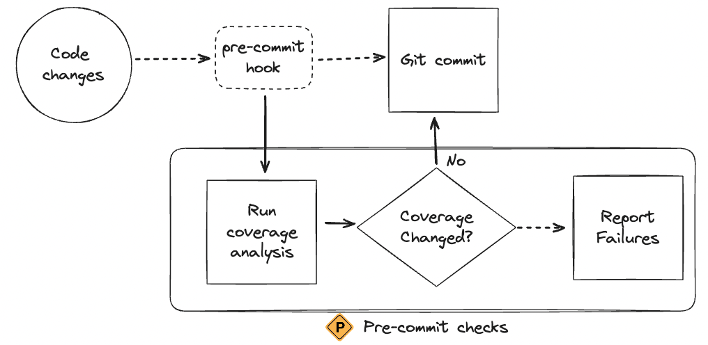
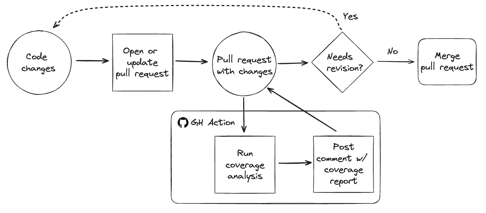
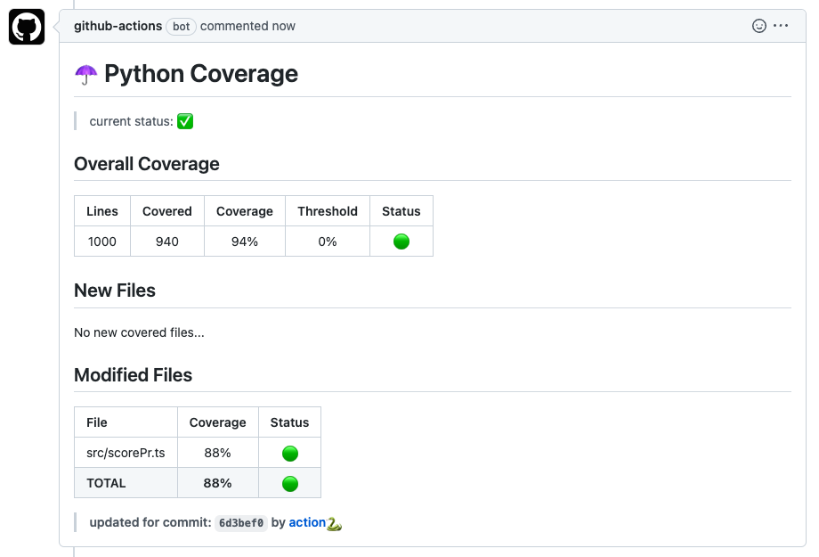

# Uncovering Code Coverage: Ensuring Software Reliability with Comprehensive Testing



## Introduction


<!--  -->

<!-- excerpt start -->

Test coverage is a crucial aspect of software development that helps ensure your code is reliable and bug-free.
By measuring how much of your code is covered by tests, you can identify untested areas and improve overall quality.
In this post, we'll dive into what test coverage is, why it matters, and explore some tools for measuring it.
Let's get started!

<!-- excerpt end -->

## What is Code Coverage?



> "With tests, we can change the behavior of our code quickly and verifiably. Without them, we really don't know if our code is getting better or worse." ([Michael Feathers, Working Effectively with Legacy Code](https://www.goodreads.com/quotes/718460-code-without-tests-is-bad-code-it-doesn-t-matter-how))

Code coverage, also known as test coverage, refers to the percentage of your code that is executed when your tests run ([Wikipedia: Code coverage](https://en.wikipedia.org/wiki/Code_coverage)).
Software developers use code coverage as a way to understand areas which may need tests.
By understanding these metrics, you can get a clearer picture of your code's reliability.

## Types of Coverage

```python
# example line
print("A line which could be tested for coverage.")

# example statement (potentially multi-line)
statement = [
    1,
    2,
    3,
]

# example function
def example():
    return "An example function."

# example branching
if 1 in statement:
    return True
else:
    return False
```

Line coverage, statement coverage, function coverage, and branch coverage are all metrics used to measure how thoroughly code is tested, but they each focus on different aspects.

- **Line coverage** tracks the execution of individual lines of code, indicating whether each line has been run during testing.
- **Statement coverage** is similar but considers whether each statement (a single unit of execution) within the code has been executed, regardless of the number of lines.
- **Function coverage** checks whether each function or method in the code has been called during the tests, ensuring that all parts of the code's interface are exercised.
- **Branch coverage**, on the other hand, goes deeper by verifying whether every possible path through control structures (like if-else statements) has been followed, ensuring that all potential outcomes and decision points are tested. 

## Benefits of Test Coverage

> "If you are testing thoughtfully and well, I would expect a coverage percentage in the upper 80s or 90s. I would be suspicious of anything like 100% - it would smell of someone writing tests to make the coverage numbers happy, but not thinking about what they are doing." ([Martin Fowler, Test Coverage](https://martinfowler.com/bliki/TestCoverage.html))

High test coverage ensures your code is reliable and less prone to bugs. 
It helps you identify untested parts of your codebase, facilitating better maintenance and encouraging a culture of quality.
This is balanced by understanding that 100% coverage is often very challenging to achieve and could be harmful in practice.

There are often times where you need to make changes to your code which can cause unforeseen issues to arise (for example, when there's coupling to other functionality).
With good test coverage, you can more confidently refactor code during these occasions, knowing that any issues will be quickly caught by your tests.
In short, it's a vital tool for any developer, providing you further insights about software which can otherwise go unseen.

## Measuring Test Coverage

### Tools

Different languages have different tools for measuring code coverage.
These tools help you visualize and understand your test coverage, making it easier to spot gaps and improve your tests.
While the implementations may differ in their processing and report formating, they all follow similar principles.
Many of these tools are available without additional cost of freely as open-source packages.
Below are just a few languages and common test coverage tools you can use with them.

- **Python**, [`coverage.py`](https://github.com/nedbat/coveragepy) is a popular open-source solution which can be paired with [`pytest-cov`](https://github.com/pytest-dev/pytest-cov).
- **R** developers often use [`covr`](https://github.com/r-lib/covr).
- **C++** developers can rely on [`gcov`](https://gcc.gnu.org/onlinedocs/gcc/gcov/introduction-to-gcov.html) or [`LCOV`](https://github.com/linux-test-project/lcov).
- **MATLAB** has built-in test coverage features through [`CodeCoveragePlugin`](https://www.mathworks.com/help/matlab/matlab_prog/types-of-code-coverage-for-matlab-source-code.html).

### Platforms

In addition to the tools mentioned above there are also various test or code coverage platforms (often [software as a service (SaaS)](https://en.wikipedia.org/wiki/Software_as_a_service) companies).
These platforms allow you to integrate the data with your GitHub workflows and often include additional insights like historical data tracking, etc.
Platforms may be an option to consider when thinking about scale and the type of information you're interested in viewing.
See below for some examples of these:

- [Codecov](https://about.codecov.io/), known for its ease of setup and comprehensive support for various languages, is a popular code coverage reporting tool that integrates with many CI/CD services and version control systems.
- [Codacy](https://www.codacy.com/coverage) is a code quality platform that includes code coverage as one of its features.
- [Code Climate](https://codeclimate.com/) is another code quality platform which includes code coverage as one of its features.

## Using `coverage.py` for Measuring Test Coverage in Python


`coverage.py` is a powerful tool for measuring code coverage in Python. 
It's easy to set up: just install it via [pip](https://pip.pypa.io/en/stable/) (or your development environment), run your tests with coverage, and generate reports in various formats.
By default, `coverage.py` measures **statement coverage** but it can be configured to measure others ([see here for more](https://coverage.readthedocs.io/en/7.6.0/index.html#capabilities)).
Interpreting these reports helps you understand which parts of your code need more testing love.

### A quick example of `coverage.py`

The following content may help demonstrate how `coverage.py` and test coverage works.
This example assumes one has installed both `coverage.py` and [`pytest`](https://docs.pytest.org/en/stable/) (a common Python testing framework) using pip (for instance, by using the command `pip install coverage pytest`).

```python
# module.py

def covered_test():
    return "This test has coverage."

def uncovered_test():
    return "This test doesn't have coverage."
```

`module.py` has two functions, one which will be covered by a test and the other which will not.


```python
# test_module.py

from module import covered_test

def test_add():
    assert covered_test() == "This test has coverage."
```

`test_module.py` has one test for `module.covered_test`.
`module.uncovered_test` remains without a test and won't be considered as covered by `coverage.py`.

```bash
# first we process test coverage
$ coverage run -m pytest
# then we show the reported output of
# processed test coverage
$ coverage report
Name             Stmts   Miss  Cover
------------------------------------
module.py            4      1    75%
test_module.py       3      0   100%
------------------------------------
TOTAL                7      1    86%
```

We use the above `coverage.py` commands to first process test coverage and then to show a report about test coverage afterwards.
Notice that `module.py` shows it does not have full coverage, indicating a possible area where we can improve testing.

## Integrating Code Coverage Tools with CI/CD Pipelines

Continuous integration and deployment (CI/CD) are essential for modern development workflows.
By integrating code coverage tools with CI/CD pipelines, you can automate the process of checking test coverage.
Setting up `coverage.py` with GitHub Actions workflows, for example, maintains high standards and can catch issues early.
Strategies like setting coverage thresholds and failing builds on coverage drops help maintain high standards.
Comparing current coverage with previous coverage can be done using techniques like hash checks for binary files or storing and comparing coverage reports.
This ensures you know exactly what's changed and can act accordingly.

### Pre-Commit Hooks to Generate `coverage.py` Reports



[Pre-commit](https://pre-commit.com/) hooks are scripts that run before a commit is finalized.
You can set up a pre-commit hook to run tests and generate coverage reports using `coverage.py` (see the example below).
This ensures consistency by comparing reports before and after changes.

```yaml
# example .pre-commit-config.yml
# See https://pre-commit.com for more information
repos:
    # process coverage within local environment
  - repo: local
    hooks:
      - id: code-cov-gen
        name: Generate code coverage
        language: system
        entry: coverage run -m pytest
        pass_filenames: false
        always_run: true
    # generate xml coverage report and export to a badge
    # for display within a readme or other documentation.
  - repo: https://github.com/Weird-Sheep-Labs/coverage-pre-commit
    rev: 0.1.1
    hooks:
      - id: coverage-xml
      - id: coverage-badge
```

If there's a significant drop in coverage, the changes are immediately visible, potentially before the commit even happens.
This workflow can also help generate metadata for association with a repository, for example, through [coverage-badge](https://github.com/dbrgn/coverage-badge) or [genbage](https://github.com/smarie/python-genbadge). 

### Pull Request Comment with `coverage.py` Reports



Another workflow which might be helpful is posting coverage reports when a pull request (PR) is opened (for example, using GitHub Action [orgoro/coverage](https://github.com/orgoro/coverage)).
This process involves generating a coverage report during the CI/CD pipeline and integrating it with the PR.



By doing so, developers can immediately see which parts of the code are covered by tests and which are not, enabling them to identify potential gaps in testing.
This transparency helps maintain high code quality, ensures that new changes are well-tested, and encourages best practices in test-driven development.

## Final Thoughts

Code coverage is a vital part of software development that helps maintain code quality and reliability. By integrating coverage tools and practices into your workflow, you can ensure your code is thoroughly tested and ready for any changes. Start using Code coverage tools in your projects today and experience the benefits firsthand!

## Additional Resources
For further reading and resources, check out the documentation for .... There are also plenty of tutorials and best practices guides available online to help you get the most out of your Code coverage efforts.

- https://linearb.io/blog/code-coverage-types
- https://learn.scientific-python.org/development/guides/coverage

