# The Codex of Arcane Prompts: Questing Through the Realm of LLMs

## The Call to Adventure

### Why LLMs Matter

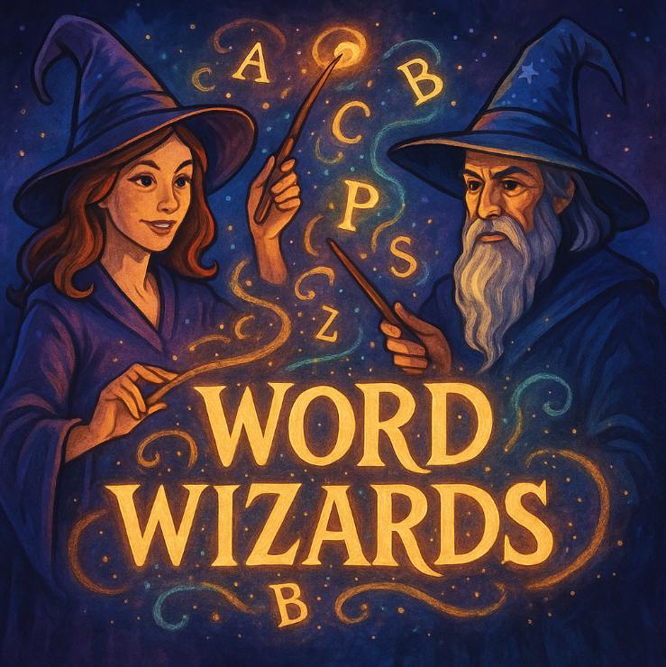

In the kingdom of digital lore, LLMs like GPT and T5 are the legendary relics that breathe life into text.
Forged through mighty Transformer architectures ([Vaswani et al. 2017](https://arxiv.org/abs/1706.03762), [Raffel et al. 2020](https://arxiv.org/abs/1910.10683)), they can summon summaries, conjure code, and translate runes from distant tongues—all with single incantations.
As you learn to wield these arcane forces, fortresses of complexity crumble before you, and your quests become powered by computational "magic".

Turn each page (or really, just scroll!) to discover core arcana, hidden libraries of lore, guild halls of platforms, the alchemist’s secret patterns, and a sorcerer’s arsenal of spells and runic glyphs.
Paired with ancient scrolls (seminal papers), you’ll grasp not only how each enchantment works, but when to call it forth and why.

## The Tome of Foundations

### The Essence of LLMs

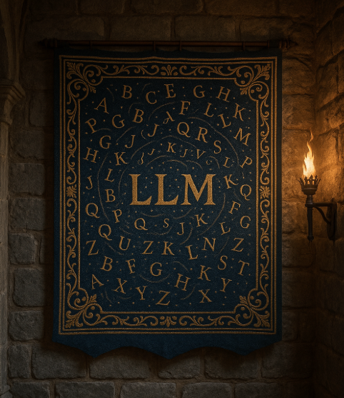

> **Runic Glyph: LLM**
> A model that predicts language through self-attention and vast text training.

Large language models (LLMs) leverage transformer (and other) models learn to predict the next token in the great tapestry of text, channeling self-attention to weave context.
Whether wielding autoregressive GPT ([Brown et al. 2020](https://arxiv.org/abs/2005.14165)) or encoder–decoder T5 ([Raffel et al. 2020](https://arxiv.org/abs/1910.10683)), understanding their temperaments (generation vs. comprehension) ensures your projects hit their mark.

### The Spellcraft of Prompting

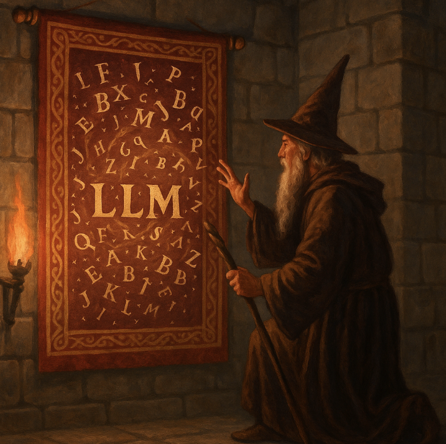

> **Runic Glyph: Prompt**
> Formatted text strings that guide LLMs magical generation.

Prompts are your incantations: structured text containing instructions, contexts, and examples.
From zero-shot to few-shot ([Brown et al. 2020](https://arxiv.org/abs/2005.14165)), these spells channel the LLM’s power.
Craft them with clarity and brevity—too long, and tokens vanish into the abyss; too short, and your spell fizzles without effect.

#### Prompting Rituals

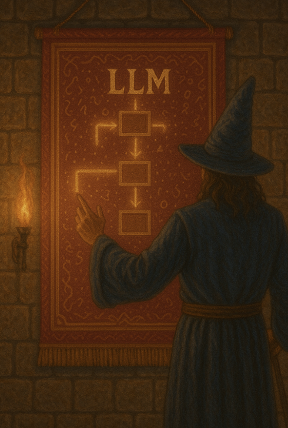

##### Chain-of-Thought (CoT)

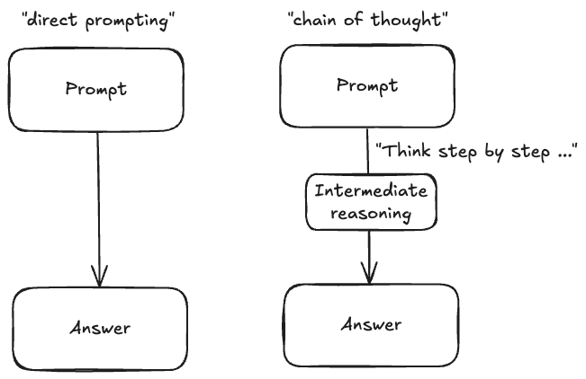

> **Runic Glyph: Chain-of-Thought (CoT) **
> A directive that unfolds the model’s intermediate reasoning steps.

The CoT ___prompt-based reasoning method___ invites your LLM to “think aloud,” laying out each inferential step like glowing runes along a scroll ([Wei et al. 2022](https://arxiv.org/abs/2201.11903)).
By prompting the model to enumerate its reasoning—“First I recall the ancient treaty… then I infer the binding clauses…”—you gain transparency into its logic and often a more accurate outcome.
In practice, CoT spells are added as interim sections in your prompt, guiding the model through multi-step puzzles with clear, human-readable breadcrumbs.

##### ReAct: Reason + Act

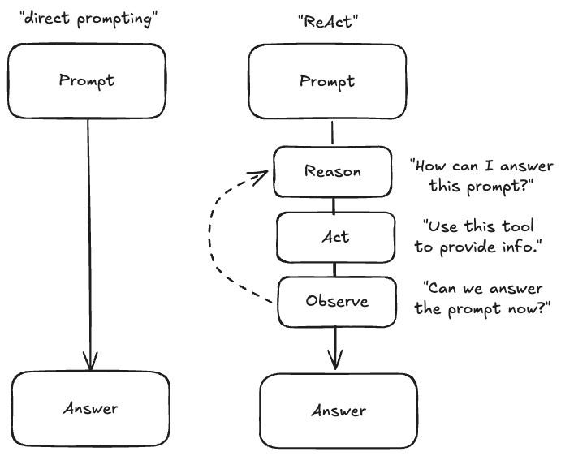

> **Runic Glyph: ReAct**
> A paradigm that interleaves model reasoning with external actions.

ReAct weaves prompt-based reasoning runes with actionable rituals ([Yao et al. 2022](https://arxiv.org/abs/2210.03629)).
As the LLM conjures its thought—“I should verify the current weather via the Weather API”—it pauses mid-incantation to call external familiars (APIs, functions, database queries), then resumes its reasoning with the newfound data.
This blend of insight and interaction empowers dynamic workflows: imagine an agent that reasons, fetches a live stock price, then composes an investment recommendation—all within one continuous spell.

Together, CoT and ReAct let you script complex magical rituals: you see *how* the spell unfolds and *when* it reaches beyond itself to summon additional data, creating both interpretability and power in your LLM applications.

### Powering up your LLM as an agent

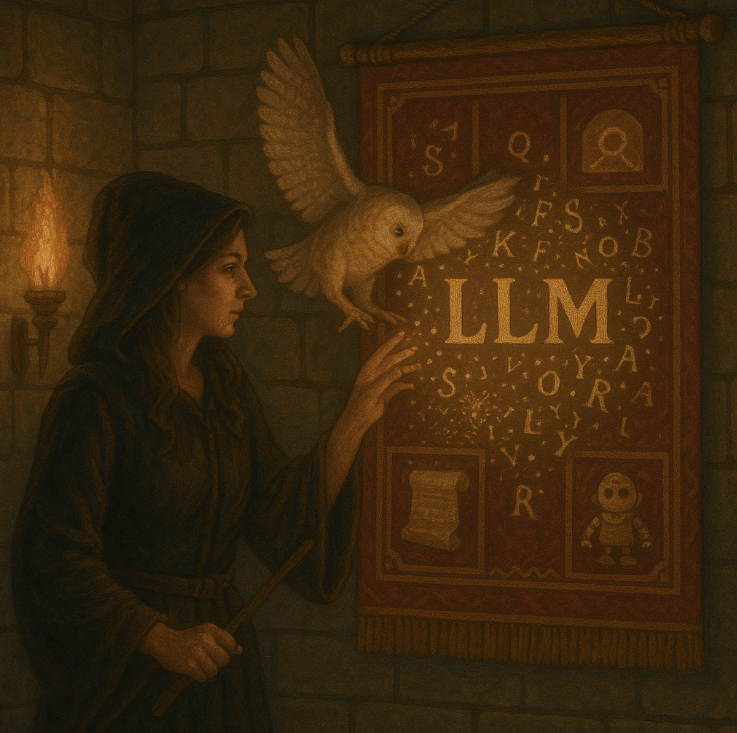

> **Runic Glyph: Agent**
> A controller that orchestrates spells, keeps memory, and invokes external tools to enhance the use of LLMs.

LLMs on their own have challenges with remembering context, sequencing their output, and executing external tools.
Agents are your summoned familiars; magical constructs that combine reasoning and action for your LLMs.
We can say that an LLM is "agentic" when it is enhanced with these further abilities that allow it to self-reason beyond what it is capable of alone.
Agents can employ prompt-based reasoning methods as described above.

#### Agent tools

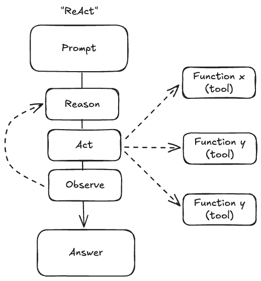

> **Runic Glyph: Agent tools**
> Tools provide your agent the ability to leverage additional capabilities such as executing a function or making an external request.

No longer must you toil by candlelight, flipping through dusty parchments—these enchanted contrivances blend Thought and Deed into seamless ReAct rituals, summoning APIs, querying databases, and casting complex multi-step spells all in a breath.
Verily, with Agent Tools at thy side, your LLM becomes not just a wise oracle, but a full-fledged magical order!

#### MCP servers

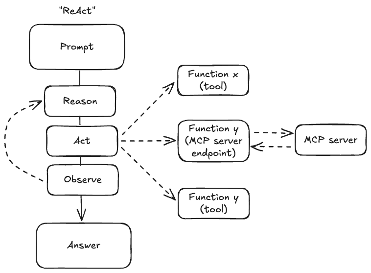

> **Runic Glyph: MCP Servers**
> MCP servers offer a standardized way to remotely call services for agents.

With MCP Servers at your command, you wield the power of a thousand wizards without so much as breaking a sweat—or a circuit.
They are the unseen champions behind every majestic inference and data transformation, ensuring your digital sorcery proceeds swiftly and surely!

## The Library of Lore

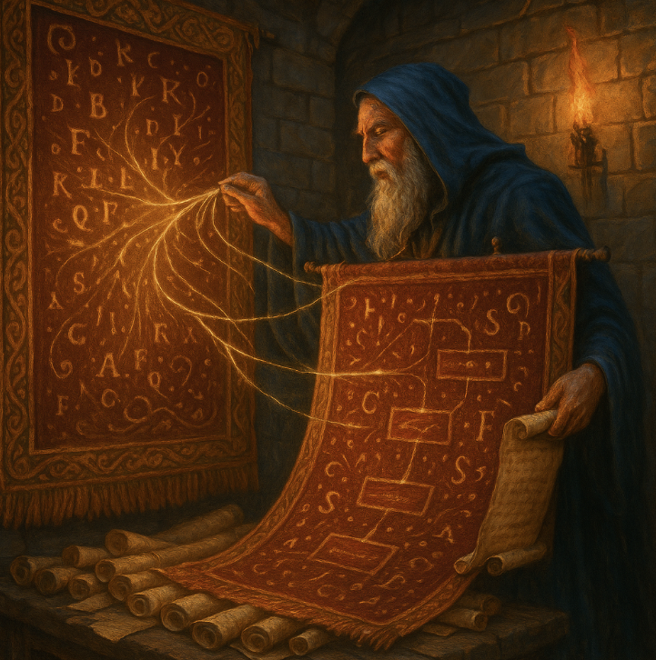

### Retrieval Data Vaults

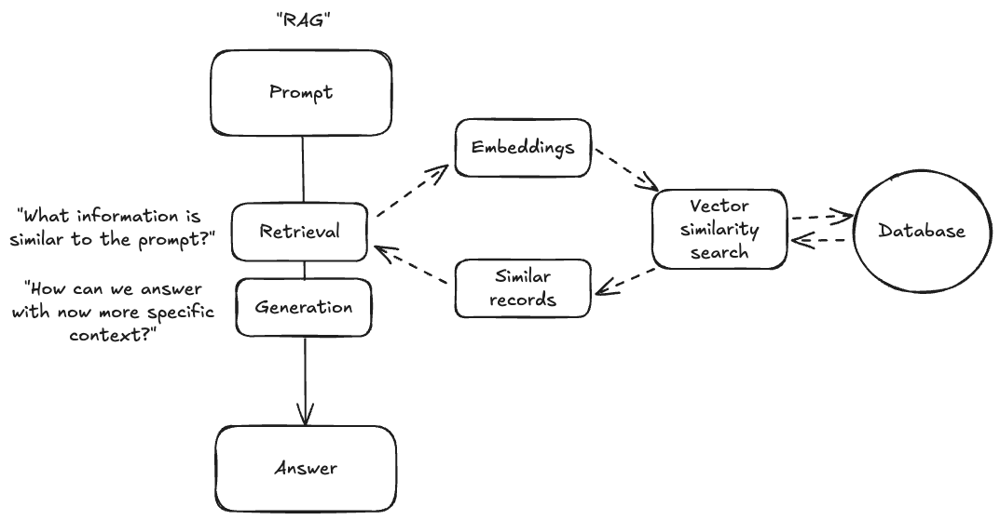

> **Runic Glyph: RAG**
> Retrieve → Condense → Generate: a pipeline for factual accuracy.

RAG systems ([Lewis et al. 2020](https://arxiv.org/abs/2005.11401)) store document embeddings in vector vaults such as [Pinecone](https://www.pinecone.io/), [Weaviate](https://weaviate.io/), [Qdrant](https://qdrant.tech/), or embedded systems such as [DuckDB](https://duckdb.org/).
At query time, you summon relevant scrolls (top‑k passages) and bind them into your spell, grounding the LLM in true lore and banishing hallucinations.

### Knowledge-Crafted Graphs

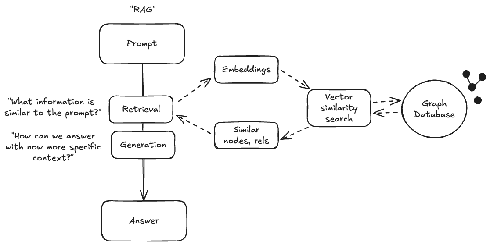

> **Runic Glyph: GraphRAG**
> Embedding retrieval enchanted with graph-based evidence chains.

GraphRAG ([Chen et al. 2021](https://arxiv.org/abs/2109.01117)) blends vector summoning with graph traversals, exploring relationships among entities like a scholar poring over ancient tomes.
This multi-hop reasoning provides provenance and deeper insights, ideal for complex quests in biomedical or enterprise realms.

## The Guildhall of Platforms

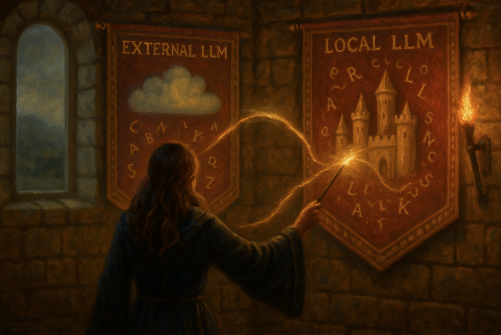

### Hosted APIs

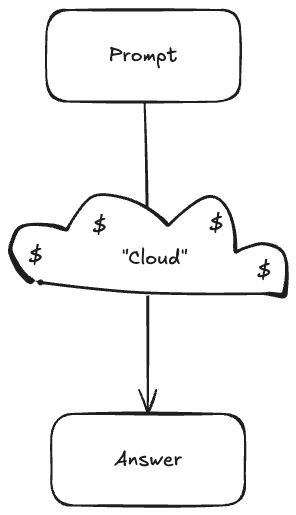

> **Runic Glyph: Hosted APIs**
> A managed endpoint for commanding pre-trained LLMs.

Closed-source oracles—OpenAI, Anthropic, Google Vertex AI—offer turnkey summoning circles.
They manage scaling, compliance, and SLAs, but heed their pricing scrolls and data policies before pledging your allegiance.

### Self-hosted APIs

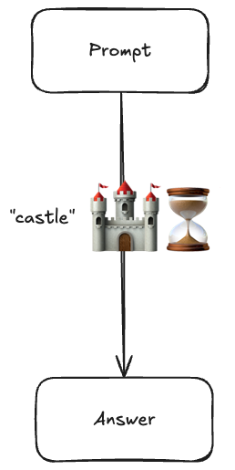

> **Runic Glyph: Self-hosted APIs**
> Self-host your LLM relics for ultimate sovereignty.

Open-source forges such as [Ollama](https://github.com/ollama/ollama), [llama.cpp](https://github.com/ggerganov/llama.cpp), [vLLM](https://github.com/vllm-project/vllm) let you craft and run models on your own hearth.
While you shoulder hardware and ops burdens, you gain full control, cost predictability, and on-prem solace.

## The Alchemist’s Workshop

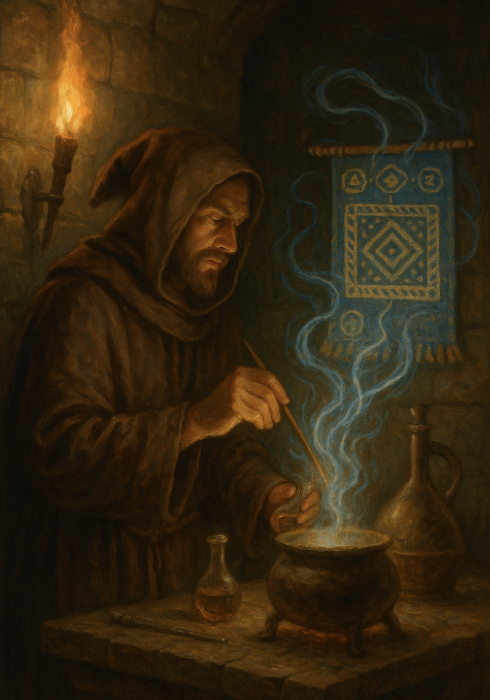

### LLM Orchestrators

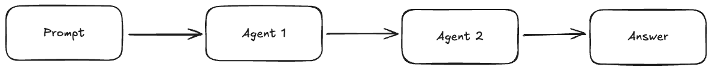

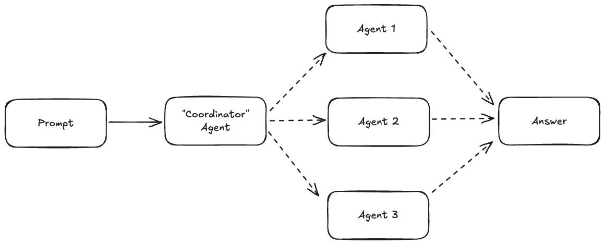

> **Runic Glyph: LLM Orchestrator**
> A framework for chaining prompts and architecting agents.

Invoke [LangGraph](https://github.com/langchain-ai/langgraph), [LlamaIndex](https://github.com/run-llama/llama_index), [Haystack](https://github.com/deepset-ai/haystack), or the [Google AI Developer Kit](https://github.com/google/adk-docs) (google-adk) to access pre-made chains, retrievers, and LLM adapters.
These libraries are like scrolls of ancient knowledge, saving you countless hours of boilerplate incantations.

### Interactive web interface packages

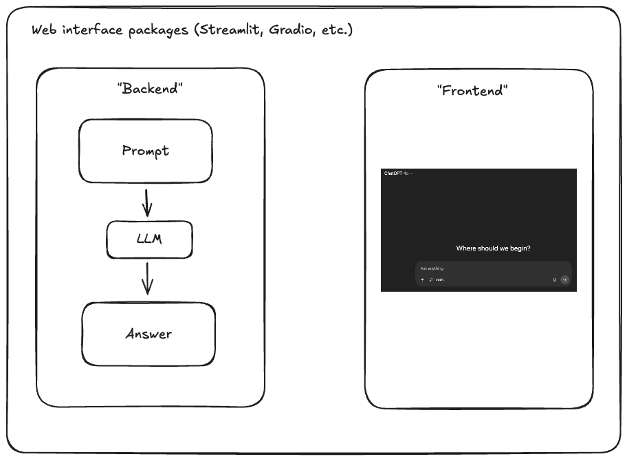

> **Runic Glyph: Web interface packages**
> Packages which allow you to quickly build and share web interfaces, including chat-based interactions with agents.

Whether through conversational UIs ([Streamlit](https://github.com/streamlit/streamlit), [Gradio](https://github.com/gradio-app/gradio)) or direct API rituals (REST, SDKs), choose the conduit that best fits your ritual circle.
Many begin with a demo UI, then migrate enchanted logic into backend services for production-grade robustness.

## The Final Ritual

### Wizardry Recap
You’ve mastered foundational spells, explored hidden libraries of lore, navigated guild halls of platforms, wielded alchemical patterns, and equipped a sorcerer’s arsenal.
You know the runic glyphs and have bound them to seminal scrolls.

### Further Scrolls to Study
Continue your journey by reading the original Transformer codex ([Vaswani et al. 2017](https://arxiv.org/abs/1706.03762)), RAG rituals ([Lewis et al. 2020](https://arxiv.org/abs/2005.11401)), the Chain-of-Thought codex ([Wei et al. 2022](https://arxiv.org/abs/2201.11903)), and ReAct incantations ([Yao et al. 2022](https://arxiv.org/abs/2210.03629)).

### Your Grand Quest
Forge your own grimoire: spin up a RAG service or an agent familiar, document your arcane experiments, and share your triumphs in a blog chronicle or lightning talk.
The realm of LLM sorcery awaits your legend!
